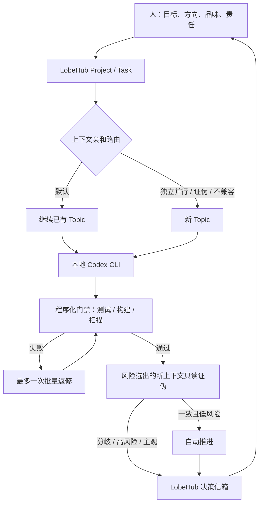

# 架构说明：LobeHub 原生工作流 + 薄治理层

## 决策

旧版把任务 UI、任务图、消息、worktree、CLI 执行、评审和审批全部自建了一遍。法律计费
Demo 的实测说明，它虽然提供了隔离与审计，却没有在单项交付上产生生产力收益：固定人类岗位式
拆分造成重复理解，返修四次，约 575 万输入 token，且看板自身还出现了合入缺陷。

LobeHub 2.2.14 已经原生提供：

- 成熟 Task/Project/Topic/评论/时间线 UI；
- 子任务、依赖、暂停、恢复、heartbeat 和 watchdog；
- Topic、Message 和 heterogeneous CLI Harness；
- Codex、Claude Code 等异构本地 CLI Harness；
- 程序、Agent、LLM 三类 Criterion 与 Rubric；
- `maxRepairRounds`、Acceptance 跨轮反馈和最终人工接受/拒绝。

因此本项目不再和它竞争。LobeHub 是产品和事实源，本项目包含无状态治理策略，以及一份只为
断点恢复存在的薄控制循环。部署优先级是未修改的本机自托管 LobeHub，而不是 LobeHub Cloud。

## 不变量

> 单一上下文连续负责，确定性系统负责门禁，独立 AI 负责证伪，Acceptance 负责结果证据，人类负责方向、品味与责任。



## LobeHub 与本项目的边界

| 能力 | 所有者 |
| --- | --- |
| 项目、任务、Topic、依赖、评论、附件 | LobeHub |
| Project、Task、Topic、Message 和 Acceptance 持久化 | LobeHub |
| heterogeneous Codex 事件转换与 server ingest | LobeHub CLI |
| 安全沙箱强制、Task–Topic 薄关联和 2.2.14 兼容处理 | 本项目适配层 |
| 运行时间线、Diff、暂停/恢复、watchdog | LobeHub |
| Criterion、Rubric、Acceptance、人工接受/拒绝 | LobeHub |
| 目标编译的组织原则 | 本项目 MCP |
| 已有 Topic 的上下文亲和评分 | 本项目 MCP |
| 多维质量计划、契约漂移和发现聚合 | 本项目 MCP |
| Codex 订阅额度与刷新时间建议 | 本项目 MCP |
| 九步推进、原子检查点、幂等状态事件与崩溃恢复 | 本项目控制循环 |
| 合并、发布、不可逆决定 | 人 |

治理 MCP 不保存 LobeHub Task 或 Topic 的副本，也不具备接受/拒绝、合并、发布或任意 shell
执行能力。控制循环的本地账本只记录阶段检查点和外部对象 ID，不提供查询/编辑任务的第二套
产品接口。

## 2.2.14 的执行边界

LobeHub 2.2.14 的 Task assignee 是 Provider Agent，而 `lh hetero exec --type codex` 是独立的
本地 CLI Harness。实测证明，把 `chatgpt` Provider Agent 当成本地 Codex CLI 会进入
`InvalidProviderAPIKey`；两者不是同一条路径。

本项目不修改 LobeHub 源码，也不使用私有 tRPC/数据库接口。在上游提供原生
Task–heterogeneous 绑定前，使用发布版 CLI 形成可删除的薄适配：

1. Project Task 保存状态、契约哈希和人的决策点；
2. 普通 LobeHub Topic 保存冻结契约、harness 事件和最终消息；
3. Task 评论以稳定 marker 关联 Topic，不复制 Task/Topic 数据；
4. `execute-topic` 通过本地 ChatGPT 登录的 Codex CLI 执行；
5. Task 评论还记录可续跑的原生 Codex session，最终文本由发布版 `message edit` 持久化；
6. 上游原生绑定可用后，只需删除 marker 关联，治理契约不变。

LobeHub 2.2.14 还有两个已验证的兼容点：

- 省略 execution-mode 时，它会为 Codex 注入危险 bypass；适配层因此强制
  `read-only` 或 `workspace-write`，并在测试中禁止 bypass 字符串；
- 它生成的 `codex exec resume` 参数顺序与当前 Codex CLI 不兼容；只在 resume
  时启用一个参数重排 shim，事件转换、进程监督和 ingest 仍由 LobeHub 负责。

首次执行时，LobeHub 转换后的 JSONL 不稳定暴露原生 Codex session。适配层因此启用发布版
`--raw-dump`，只读取 `thread.started.thread_id` 作为 `continuation_session_id`，写入 Task 评论
后立即删除受限临时目录。返回值中的 `session_id` 始终表示本次调用传入的 resume ID；二者不应
混淆。

## 可恢复九步控制循环

`run-governed-task` 是单一主控，不是另一个 Coordinator Agent。它按固定治理状态推进，但每个
状态内部仍按风险动态决定是否需要新上下文：

| 阶段 | 自动动作 | 可恢复检查点 | 停止条件 |
| --- | --- | --- | --- |
| 01 Contract | 编译目标并冻结 SHA-256 契约 | 完整冻结契约 | 缺少可观察验收、安全边界、回滚或信号 |
| 02 Bind | 创建/核对 Task，建立 Owner Topic | Task、Topic、契约 Message ID | 现有 Task 契约哈希不一致 |
| 03 Route | 选择最匹配的已有 Topic/Session | 路由解释、Topic、Session ID | 上下文不兼容时改用新 Topic |
| 04 Quota | 读取本地额度并冻结本轮模型 | 额度模式、Owner/Verifier 模型 | 额度触顶时等刷新 |
| 05 Owner | 连续 Owner 调查并实现 | user/assistant Message、operation、Session | 高风险材料执行尚未获人确认 |
| 06 Gates | 运行仓库确定性门禁 | argv、退出码、耗时、脱敏尾部、输出哈希 | 无可用仓库门禁时要求配置 |
| 07 Falsify | 按质量计划启动只读反证 Lane | 每 Lane Topic、Message、结构化发现 | 门禁失败时跳过，避免浪费 token |
| 08 Repair | 失败批量回原 Owner，一次返修后全回归 | 返修轮数、门禁和反证结果 | 第二次失败、缺证据或分歧升级给人 |
| 09 Acceptance | 计算 release readiness 并准备 handoff | 验收标准、最终聚合、人工边界 | 永远停在最终人工 accept/reject 前 |

### 账本与 LobeHub 的一致性

账本默认是 `.data/governed-runs/<run_id>.json`，使用临时文件、`fsync` 和原子替换落盘，并用
操作系统文件锁阻止两个主控同时推进同一运行。它只保存：

- 当前阶段与每个阶段的 `pending/running/completed/skipped/waiting/interrupted`；
- LobeHub Task/Topic/Message ID、heterogeneous operation ID 和原生 Codex Session ID；
- 冻结契约、模型决策、结构化发现和脱敏程序门禁摘要；
- 带稳定 `event_id` 的状态转换，以及该事件是否已同步到 LobeHub。

状态先写本地账本，再以 `[engineering-governance run-event]` 评论同步到 Task。若评论成功后本地
进程退出，恢复会先从 Task activities 查找同一个 `event_id`，存在就只补本地确认，不重复评论。
Task 尚未创建时产生的早期事件会在 Bind 完成后按序补写。

Codex turn 的 prompt message 与 assistant placeholder 也在启动模型前分别落检查点。如果本地在
LobeHub 已经保存最终 assistant 正文后退出，恢复会直接采用该正文；若仍是占位符，工作范围又
明确禁止外部/不可逆动作，控制循环才在同一工作契约下从仓库现状继续。已经完成的阶段绝不重跑。

### 权限和返修不变量

- Owner 固定为 `workspace-write + --approve-for-me`，但仍在 Codex 沙箱内；
- 所有反证 Lane 固定为 `read-only`，fresh-context Lane 必须使用新 Topic 且不继承 Owner Session；
- 程序门禁用 argv + `shell=False`，拒绝内联解释器、删除、网络搬运、发布、部署和危险 Git
  命令；执行前后工作区指纹变化会把门禁判为失败；
- Gate 输出在本机先脱敏，Task 状态事件不携带 stdout/stderr；
- 自动返修计数在执行返修前落盘，一旦为 1 就不会再开启第二轮；
- `awaiting_human_acceptance` 是成功终点，绝不伪装成已被人接受或已发布。

## 自托管与身份边界

“不登录 LobeHub Cloud”和“数据库里完全没有用户身份”不是一回事：

- 上游完整应用可以自托管，UI 和数据服务运行在本机；
- 持久化的 Project/Task/Topic 仍需要一个本地用户 ID 作为数据所有者；
- 本项目允许暂缓这一步，但暂缓期间只完成代码与配置验证，不宣称 live workflow 已就绪；
- 不修改上游认证代码，不把本地任务同步到 Cloud，也不配置模型 API Key；
- 自托管版必须先通过“完整任务/验收能力”和“仅用本地 Codex CLI、零 API Key”两项验收。

`ORCH_LOBEHUB_SERVER` 指定目标实例。默认值仍是上游 CLI 的
`https://app.lobehub.com`，但当前项目策略不会自动登录它；本机实例准备好后显式设置为
`http://127.0.0.1:3210`。CLI 登录命令会把 `--server` 精确传给官方 `lh`，避免误登云端。

## 目标编译

`compile_engineering_goal` 只生成契约，不创建第二套任务：

1. 冻结用户结果、非目标、禁止行为、假设、约束和变更面；
2. 缺少可观察验收、安全边界、恢复路径或高风险可观测信号时返回 `needs_clarification`；
3. 生成带版本和 SHA-256 哈希的契约，后续受保护字段变化都进入人的决策点；
4. 固定一个连续 owner Topic；
5. 按风险与变更面选择需求、架构、测试、安全、供应链、体验、性能、可观测、运维、发布维度；
6. 自动返修上限固定为一次；分歧、模糊、主观体验、外部影响和最终合并升级给人。

## 上下文路由

`route_to_context` 接收 LobeHub 提供的候选 Topic 摘要，按以下可解释信号评分：

- 相同 Project；
- 相同仓库；
- 相同或相邻文件路径；
- 标题/摘要与当前工作的概念重合；
- Topic 状态可继续；
- 显式污染或不兼容标记会大幅扣分。

普通交付/返修达到阈值就继续原 Topic。对抗证伪无条件新建 Topic，避免作者上下文污染
评判。

## 质量 DAG 与 Acceptance 分离

不是每个任务都走“规划 → 开发 → Review → QA”的固定流水线。验收节点按证据性质生成：

```text
程序门禁（确定性，不是 Acceptance check）
  ├─ 失败 → 一次集中返修 → 重跑
  └─ 通过
       ├─ 低风险 → owner 自证或自动继续
       └─ 中高风险 → 按维度新 Topic 只读对抗证伪
                        ├─ 一致 → 自动继续/最终人验收
                        └─ 分歧 → 人的决策信箱
```

`aggregate_verification_findings` 只保留置信度至少 80 且有具体证据的发现，并按维度、位置和
摘要去重。阻断问题一次性回给原 owner，避免 reviewer 一条一条驱动反复返修。

LobeHub Rubric 的 `maxRepairRounds=1` 对应返修上限。Criterion 只表达用户/操作员会接受或拒绝
的结果；测试、构建、Lint、类型和扫描器是发布前置门禁。官方 Acceptance Skill 负责结构化
证据、不可变 round、跨轮 lineage 和稳定最终页面，本项目不复制这套状态。

## Agent 不是岗位

Bootstrap 只配置三种逻辑入口，但它们表达上下文性质，不模拟公司组织架构：

- Coordinator：冻结契约、选择上下文和决策点；
- Delivery Owner：`hetero:codex:workspace-write`，连续持有调查、实现与一次返修；
- Read-only Falsifier：`hetero:codex:read-only`，临时的新上下文证伪，绝不修改交付。

高风险计划可以把 verifier 临时拆成安全、体验或运维等 Lane；这仍是证据隔离，不是“安全部、
QA 部、测试工程师”等固定角色。

## 额度

`get_codex_quota_advice` 延用经过测试的 Codex App Server 额度读取：只调用
`account/read` 与 `account/rateLimits/read`，剥离常见 API Key 环境变量，不读取 OAuth
Token，不发送模型请求。

额度建议会在 Bootstrap 时为 Coordinator、owner 和 verifier 的逻辑执行策略选择 Codex 模型，也可供
每个新任务重新咨询。已有 Topic 的连续性优先于换模型；额度触顶则返回刷新时间并建议等待，
未知额度使用谨慎档。系统不会购买额外用量或消耗 reset credit。

## 许可证与升级

LobeHub 完整应用作为未修改的外部发行版使用。我们不复制、不派生、不重新分发它的源码，
只依赖稳定的 Desktop/CLI/MCP/Skill 接口。这样可以直接获得上游 UI 和运行时改进，并避免
维护一个长期分叉。

旧版保存在 Git 标签 `legacy-local-orchestrator-v1`，现有 `.data` 不迁移、不删除。待新的
LobeHub 工作流通过真实开发例子后，再单独决定是否删除兼容代码。
