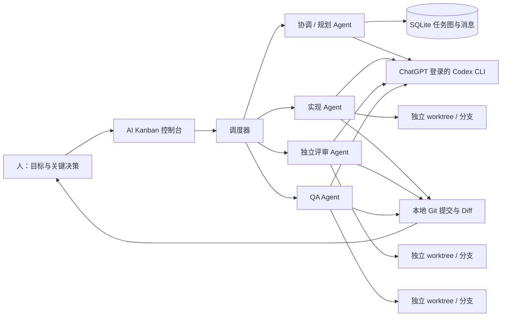
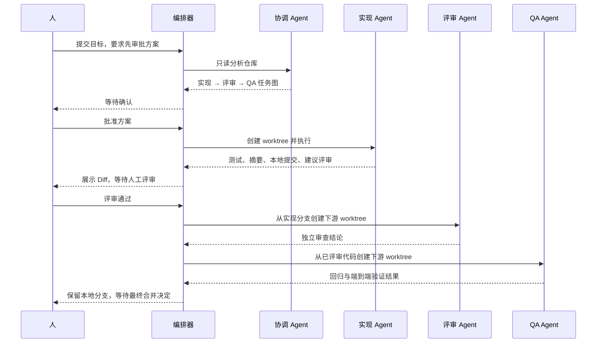

# 架构说明

## 目标

这个工程不是一个“大包大揽的超级 Agent”，而是一个本地控制面：让多个强执行 Agent 在明确角色、任务依赖、隔离代码空间和人工决策点下协作。



## 组件

| 组件 | 职责 |
| --- | --- |
| Web 控制台 | 项目接入、任务创建、状态看板、消息、审批、评审和 Diff 展示 |
| SQLite 数据库 | 保存项目、任务图、运行、事件、消息、会话、审批和交接信息 |
| 调度器 | 并发工位、领取任务、依赖解锁、自动调度、启动恢复和结果状态机 |
| Codex 执行适配器 | ChatGPT 登录预检、构造 `codex exec`、JSONL 事件、结构化输出、会话恢复和环境变量隔离 |
| Git 服务 | 仓库校验、安全 ref、worktree、本地任务分支、依赖分支整合、Diff 和本地提交 |
| 结构化结果协议 | 约束 Agent 的结果、交接、测试、子任务提议、消息和下一状态 |

## 一次典型功能的状态流



## 任务图与代码继承

每个任务可以有父任务和任意数量的前置依赖。只有全部依赖进入 `done`，任务才从 `blocked` 变为 `ready`。

执行时：

1. 没有代码依赖的任务从项目基准分支创建 worktree；
2. 有一个已完成依赖时，从该依赖的任务分支创建；
3. 有多个依赖时，以第一个分支为基线，在新 worktree 中依次本地合并其余依赖分支；
4. 冲突会让任务失败并保留证据，不会修改主工作目录；
5. Agent 结束后，编排器把变更提交到当前任务分支；
6. 编排器不 push，也不把任务分支合入项目基准分支。

协调 Agent 产生的子任务默认依赖协调任务本身，所以必须先完成方案审批，子任务才会释放。子任务之间还能按提议标题建立额外依赖。

## Agent 通信

通信不是多个终端自由聊天，而是经过控制面的持久消息：

- 人可以在任务详情中给 Agent 留消息；
- Agent 可向同项目、且已出现在上下文里的任务 ID 发送交接消息；
- 消息随下一次执行或会话恢复进入任务上下文；
- 每个任务另有 `summary` 和 `handoff`，供人和下游任务核对；
- Codex 会话 ID 保存到任务，退回修改时在同一会话和 worktree 中继续。

这种机制牺牲了无约束群聊的自由度，换来可审计、可重放和明确的任务所有权。

## 人工闸门

有三类停点：

1. 任务预设 `requires_approval`：Agent 完成后等待批准，批准才标记完成；
2. Agent 主动返回 `needs_approval`：遇到架构、安全、迁移或产品歧义时提出具体问题；
3. 实现返回 `recommended_stage=review`：进入人工代码评审，可通过或带说明退回。

拒绝或要求修改不会创建新任务，而是给原任务追加人工消息并恢复同一个 Codex 会话。这样保留上下文、Diff 和责任边界。

## Codex 执行契约

首次执行大致等价于：

```text
codex exec --json --sandbox <read-only|workspace-write> \
  --cd <task-worktree> --output-schema <schema> \
  -o <run-final.json> <prompt>
```

编排器记录 JSONL 事件中的会话 ID和 token 使用量，并读取最终结构化 JSON。提示词对所有角色施加共同边界，再添加角色职责和任务上下文。

协调/规划使用 `read-only`。实现/评审/QA 使用 `workspace-write`；评审需要可写测试临时文件，但被限定在独立 worktree，且角色契约禁止编辑产品代码。

## 失败处理

- Codex 非零退出、结构化结果缺失、Git 冲突或超时：任务进入 `failed`；
- 依赖未完成：任务保持 `blocked`；
- Agent 报告外部阻塞：任务进入 `blocked` 并显示原因；
- 服务在任务运行时退出：下次启动把该任务和运行标记为失败；
- 失败或阻塞任务可以从看板重试；已有 worktree 和会话会被复用。

## 当前刻意没有做的事

- 不自动 push、开 PR、合并、发布或部署；
- 不接 OpenAI API，也不管理 API Key；
- 不接 GitHub、Linear、Slack 等云服务；
- 不提供远程多用户鉴权；
- 不自动删除 worktree 和 Agent 分支；
- 不把自然语言 Agent 聊天当成可靠状态，所有关键状态都进入数据库。

这些边界让第一版更适合作为单机研发团队控制台。后续可以在不破坏安全模型的前提下增加 PR/CI 触发器和更多执行端。
