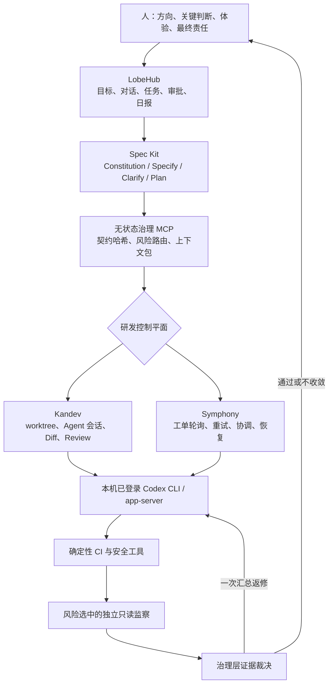
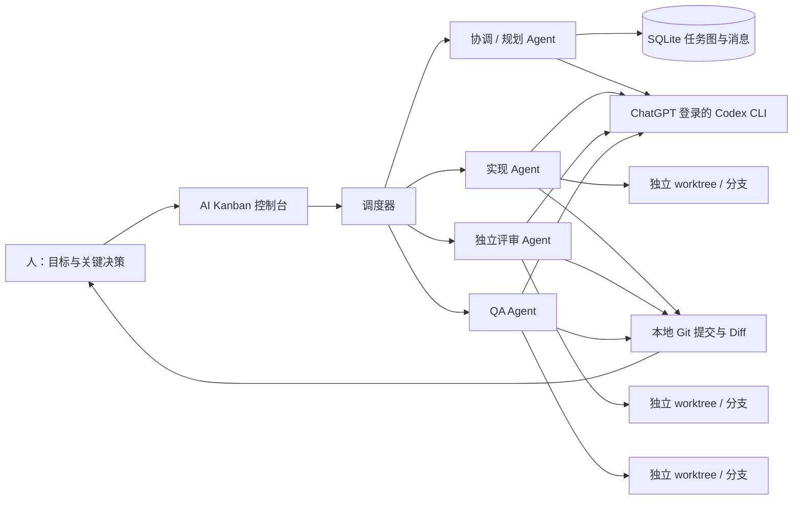
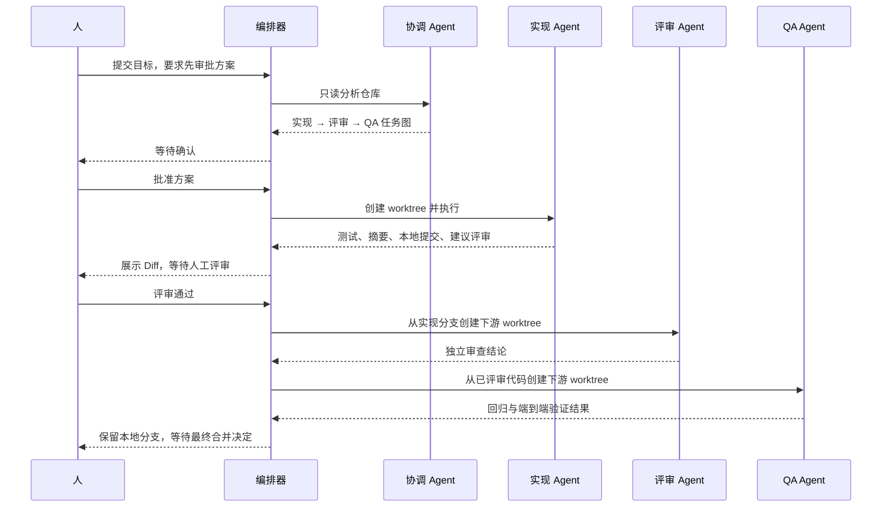
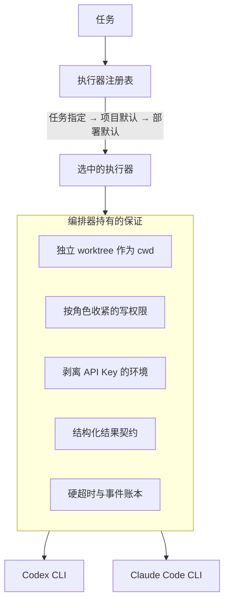
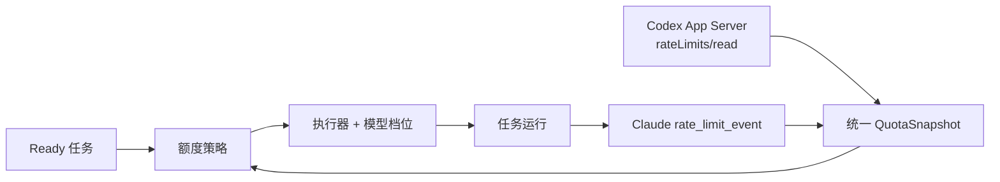
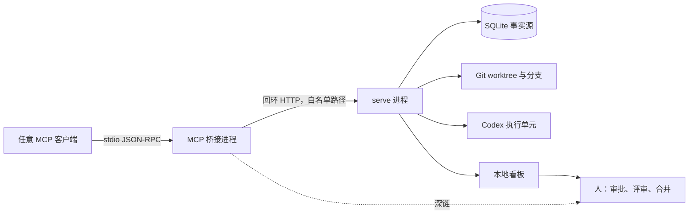

# 架构说明：AI 原生交付治理

## 架构决定

本分支不再把一个自研看板和固定角色任务图当作产品中心。成熟组件持有它们擅长的状态，本仓库只持有可版本化、可测试的治理策略。



### 唯一事实源

| 事实 | 所有者 |
| --- | --- |
| 人的目标、决策、批准、任务展示 | LobeHub |
| 规格、澄清、方案与任务文档 | Spec Kit / 版本库 |
| 开发会话、worktree、Diff | Kandev，或被选择的外部控制平面 |
| 长时间工单尝试、重试与协调 | Symphony（启用时） |
| 编译、测试、扫描和运行结果 | CI 与对应确定性工具 |
| 工作契约哈希、路由规则、证据过滤规则 | 本治理层的版本化代码和仓库文件 |
| 最终合并、发布和不可逆决定 | 人 |

本治理层没有任务表、审批表、Agent 会话或分支状态。相同输入必然得到相同契约、验证计划、控制平面交接清单和裁决结果。契约与验证计划分别带有内容哈希，修改字段但保留旧哈希会被拒绝。

## 三阶段纯函数协议

### 1. 契约编译

`GovernanceEngine.compile_contract()` 接收经人或 Spec Kit 整理的目标，验证用户、可观察结果、验收标准、非目标、高风险人类决策等缺口。所有意图字段进入规范化 SHA-256 哈希；改变意图会产生新的 `contract_id`。

关键词只能扩大检查范围，不能单独证明存在风险。不可逆或生产级 `critical` 只能由契约显式声明。

### 2. 风险路由与上下文隔离

`route()` 默认保持一个连续开发 owner。低风险文档类改动只运行确定性检查；普通代码增加需求、架构和测试质量；安全、数据、UI、性能与高风险对抗通道按风险信号启用。

`context_packets()` 为每条语义通道生成不同上下文：共同拥有同一契约哈希，但看不到开发聊天和其他监察结论，仓库权限为只读，外部写权限永远关闭。

`delivery_handoff()` 把已验证的契约和计划编译为 Kandev/Codex 可消费的执行清单：先创建连续 owner，只在确定性证据通过后创建风险选中的全新只读监察任务，并明确 Profile 权限、一次返修和人类闸门。它不调用 Kandev，也不创建任务。

### 3. 证据裁决

`adjudicate()` 先处理确定性结果，再处理 Agent 发现。任何预先声明但未提交结果的确定性检查都会阻塞。置信度不足 0.80、无法证明由本次引入、来自未启用通道、缺证据、高危但不可复现的问题不会阻塞；相同根因和位置只保留证据最强的一条。

第一次存在阻塞项时生成一个合并返修包，owner 保持原上下文修复。第二轮仍失败、结果有争议或需要人类权力时停止，不再自动循环。

## 兼容层边界

下文描述的是旧版 Python 看板、SQLite 任务图和固定角色执行器。它们为了迁移和回归仍然存在，但新功能不得继续扩大这一层。新架构通过 `governance` CLI、`governance-mcp` 和 `.ai-delivery/` 文件与成熟控制平面组合。

---

## 旧版架构说明（兼容保留）

## 目标

这个工程不是一个“大包大揽的超级 Agent”，而是一个本地控制面：让多个强执行 Agent 在明确角色、任务依赖、隔离代码空间和人工决策点下协作。



## 组件

| 组件 | 职责 |
| --- | --- |
| Web 控制台 | 项目接入、任务创建、状态看板、运行告警、消息、审批、评审和 Diff 展示 |
| SQLite 数据库 | 保存项目、任务图、运行、事件、消息、会话、审批和交接信息 |
| 调度器 | 并发工位、领取任务、依赖解锁、自动调度、启动恢复和结果状态机 |
| 执行器注册表 | 按任务解析执行器、分别做可用性预检、把一个执行器的故障隔离在它自己的任务上 |
| 额度观察与策略 | 将 Codex App Server 和 Claude rate-limit event 归一成额度快照，按余量、刷新时间、角色和优先级选择执行器与模型 |
| 执行公共内核 | 进程监管、硬超时、事件抽取、环境变量剥离、提示词脱敏、结构化结果提取与校验 |
| Codex 执行适配器 | ChatGPT 登录预检、构造 `codex exec`、JSONL 事件、原生 `--output-schema` 输出、会话恢复 |
| Claude Code 执行适配器 | 构造 `claude -p`、按角色收紧工具白名单、stream-json 事件、在本地强制结果契约 |
| Git 服务 | 仓库校验、安全 ref、worktree、本地任务分支、依赖分支整合、Diff 和本地提交 |
| 结构化结果协议 | 约束 Agent 的结果、交接、测试、子任务提议、消息和下一状态 |
| MCP 桥接层 | 把受控的一小组工具通过 stdio 暴露给任意 MCP 客户端；无状态，只转发到本机 HTTP API |

## 一次典型功能的状态流



## 任务图与代码继承

每个任务可以有父任务和任意数量的前置依赖。只有全部依赖进入 `done`，任务才从 `blocked` 变为 `ready`。

执行时：

1. 没有代码依赖的任务从项目基准分支创建 worktree；
2. 有一个已完成依赖时，从该依赖的任务分支创建；
3. 有多个依赖时，以第一个分支为基线，在新 worktree 中依次本地合并其余依赖分支；
4. 冲突会让任务失败并保留证据，不会修改主工作目录；
5. Agent 结束后，编排器把变更提交到当前任务分支；
6. 编排器不 push，也不把任务分支合入项目基准分支。

协调 Agent 产生的子任务默认依赖协调任务本身，所以必须先完成方案审批，子任务才会释放。子任务之间还能按提议标题建立额外依赖。

## Agent 通信

通信不是多个终端自由聊天，而是经过控制面的持久消息：

- 人可以在任务详情中给 Agent 留消息；
- Agent 可向同项目、且已出现在上下文里的任务 ID 发送交接消息；
- 消息随下一次执行或会话恢复进入任务上下文；
- 每个任务另有 `summary` 和 `handoff`，供人和下游任务核对；
- Codex 会话 ID 保存到任务，退回修改时在同一会话和 worktree 中继续。

这种机制牺牲了无约束群聊的自由度，换来可审计、可重放和明确的任务所有权。

## 监察与对抗

闸门只有在人拿到足够信息、且被审查的一方无法自行消除证据时才有意义。三条机制服务于此：

**评审者不得修改产品代码。** 评审角色需要可写工作树来跑测试，但只要 Git porcelain 能看到已跟踪修改或未跟踪新文件，编排器就拒绝提交、记录 `review.contract_violation` 事件并让任务失败，改动留在 worktree 里作为证据。理由是这条边界一旦松开会双重失效：本该写成结论的问题被就地改掉，人看到的 diff 里实现与评审混在一起，无法分辨。QA 不受此限，它的职责本就包含补测试。

**独立评审换执行器。** 协调者拆出的子任务默认继承父任务的执行器，评审角色例外——只要还有另一个可用执行器，评审就交给它。同一个模型评审自己的产出是整条闸门链里最弱的一环。单执行器部署时自动回退，`ORCH_CROSS_REVIEW=0` 可关闭。

**自报检查进入账本并呈现在闸门上。** Agent 结果里的 `tests` 写入任务的 `evidence` 字段，在任务详情里单列一节。这些是**声明而非证明**——编排器不会替 Agent 重跑测试。把它们存下来的价值在于可审计：一个声称完成实现却报告空检查列表的任务，那个空列表本身就是信号，界面会显著标出。

尚未做到的：编排器不独立验证测试是否真的执行过，也不强制"完成前必须经过评审或 QA"。前者需要在受控环境里重跑并比对，后者需要工作流模板约束协调者的拆解。这两条目前依赖人工判断。

## 运行监控与修复闭环

监控分三层，避免只靠某一个 Agent 自己说“运行正常”：

1. `ProcessSupervisor` 实时抽取 stdout/stderr，并对每次 CLI 运行设置硬超时；
2. SQLite 事件表保存完整原始证据，服务重启也不会丢；
3. 任务详情每 3 秒读取聚合告警，突出 `run.failed`、`task.blocked`、`task.executor_unavailable`、`task.quota_deferred`、`review.contract_violation` 和两种 CLI 的 stderr。重复信号归并计数，已知插件安装噪声过滤，但原始事件不删除。

发现异常后的安全闭环是：


编排器不让观察器直接热改正在运行的任务分支，也不自动合并。这样即使“修复 Agent”判断错误，原始失败现场、修复 Diff 和审批记录仍然分开。当前版本已完成事件采集、持久化、聚合告警与人工修复入口；独立于服务进程的 OS watchdog、自动重启和外部通知仍属于后续能力，服务本身崩溃时应由 launchd/systemd 等进程管理器接管。

## 人工闸门

有三类停点：

1. 任务预设 `requires_approval`：Agent 完成后等待批准，批准才标记完成；
2. Agent 主动返回 `needs_approval`：遇到架构、安全、迁移或产品歧义时提出具体问题；
3. 实现返回 `recommended_stage=review`：进入人工代码评审，可通过或带说明退回。

拒绝或要求修改不会创建新任务，而是给原任务追加人工消息并恢复同一个 Codex 会话。这样保留上下文、Diff 和责任边界。

## Codex 执行契约

首次执行大致等价于：

```text
codex exec --json --sandbox <read-only|workspace-write> \
  --cd <task-worktree> --output-schema <schema> \
  -o <run-final.json> <prompt>
```

编排器记录 JSONL 事件中的会话 ID和 token 使用量，并读取最终结构化 JSON。提示词对所有角色施加共同边界，再添加角色职责和任务上下文。

协调/规划使用 `read-only`。实现/评审/QA 使用 `workspace-write`；评审需要可写测试临时文件，但被限定在独立 worktree，且角色契约禁止编辑产品代码。

Claude Code 同时使用工具白名单和官方原生 Bash sandbox。只读角色拿不到编辑或 Bash 工具；写角色可以运行本地检查，但设置要求 sandbox 启动失败时整个任务失败、禁止 unsandboxed command、禁止本机回环地址和本地端口监听。只禁用 `WebFetch` 并不能约束 Bash 里的网络程序，因此 OS sandbox 是不可省略的一层。

## 执行器

执行器是可替换的，工程保证不是。任何 CLI 接进来都拿到同一套东西：



差别只在于每个 CLI 各自能原生提供多少，以及缺的部分由谁补。

结果契约两边都是原生的：Codex 用 `--output-schema` 加 `-o`，Claude Code 用 `--json-schema`，并把校验过的对象放在最终 `result` 事件的 `structured_output` 字段里。执行器优先读它，只有该字段缺失时才退回到从回答文本里提取 JSON——那条降级路径留给行为不同的 CLI 版本，不是常规路径。无论走哪条，缺必填字段的运行一律失败，不会有自然语言结论直接驱动任务状态。

只读隔离两边不同。Codex 有 `--sandbox read-only`；Claude Code 用工具白名单让协调和规划角色根本拿不到编辑类工具，并为所有可能获得 Bash 的角色强制启用原生 sandbox。命令行 `--settings` 要求 sandbox 不可用时直接失败，且禁止放行未隔离命令。本机尚未安装可直接调用的 Claude CLI，因此本轮对这部分完成了命令构造和策略测试，真实 Claude 端到端仍需在 CLI 可用的机器上验收。

还有一处 Claude Code 特有的收口：任务进程不继承操作者配置的 MCP 服务（`--mcp-config '{"mcpServers":{}}' --strict-mcp-config`）。否则那是一片工具白名单看不见的工具面，包括网络出口。

新增执行器要实现的只有三件事：`preflight()`、`build_command()` 和一个把该 CLI 的 stdout 变成事件的解析器。进程监管、超时、环境剥离、提示词脱敏都在 `agent_base.py` 里共享。

`preflight()` 必须真的检查登录，而不只是检查文件存在：`codex login status` 要求 ChatGPT 登录，`claude auth status` 返回 JSON 并校验 `loggedIn`。订阅访问由剥离 API Key 环境变量强制，预检只是让问题在任务开跑前就暴露。

一个执行器不可用时，注册表仍然是就绪的，只要还有别的执行器可用。指定了缺失执行器的任务会带着原因单独失败，自动调度不会因此停摆。

## 额度感知调度

额度调度位于任务图和执行器注册表之间，不触碰供应商凭据：



统一快照保存 `used_percent`、`remaining_percent`、`window_minutes`、`resets_at`、数据来源和置信度。Codex 的主桶用于通用模型决策，Spark 等独立桶同时保留给控制台展示；Claude 的事件可能逐个报告五小时、七天或特定模型窗口，因此采用合并快照。

策略先尊重不可变约束：恢复中的会话、任务手工指定和项目默认不会被额度比较改写。只有未固定的任务才在可用执行器间评分。评分以最紧窗口的剩余比例为主，临近刷新加分，长窗口且刷新尚远时略作保留。任务角色、优先级与额度档位共同决定 `high / balanced / economy`，最终由执行器映射为供应商模型名。

实时额度缺失不是零额度。此时快照明确标记为 unknown，调度器采用谨慎档并轻微偏好部署默认执行器。额度真正触顶时，手工启动返回清楚的刷新提示，自动任务记录 `task.quota_deferred` 并保持可执行，最多每五分钟重新检查一次。已经超过 `resets_at` 的快照不再作为触顶证据；如果所有窗口都过期，状态回到 unknown/cautious，让一个谨慎任务获取新额度事件，而不是永久死锁。

调度决定作为 `task.scheduled` 事件写入账本，任务同时保存 `assigned_executor` 和 `assigned_model`。这既让人能追溯“为什么选它”，也确保有会话 ID 的重试不会跨执行器恢复；原执行器已被禁用时任务明确失败，不会把另一个供应商的模型名传给错误的 CLI。

## MCP 边界

`orchestrator/mcp_server.py` 让外部对话式客户端（Claude Code、Codex CLI、LobeHub 等）能够驱动这个内核，而不需要它们理解 worktree、依赖图或审批状态机。



三条不变量：

1. **桥接进程无状态。** 它不打开数据库、不启动调度器、不启动 Codex，因此不存在第二个调度器和 worktree 竞争。`serve` 仍然是唯一写入方。
2. **接口白名单。** 桥接层持有一份硬编码的 `(方法, 路径)` 白名单，并且拒绝非回环地址。HTTP API 比白名单宽，这是刻意的。
3. **闸门不进工具面。** 审批、拒绝、评审决定、项目登记、人工消息一律不是工具。需要人决定时，工具返回 `http://127.0.0.1:8765/#/task/<id>` 深链，人在看板上决定。

任务只有处于 `backlog` 或 `ready` 时才能进入队列，数据库更新还带状态条件。因此 `review`、`waiting_approval` 等人工闸门状态不能通过 MCP `run_task`、HTTP start 或并发重复请求重新排队。HTTP 控制面同时拒绝非回环 Host、非 JSON 写请求和跨源浏览器写请求；Agent 进程的 OS sandbox 则禁止访问回环控制面。

`plan_workflow` 会强制把协调者任务的 `allow_delegation` 和 `requires_approval` 设为真，调用方无法关闭：模型可以提出任务图，但任务图在人批准之前不会解锁。

MCP 是拉取式的，桥接层没有向客户端主动推送的通道。因此本地看板不是可以删掉的冗余——它仍然是实时监看 Diff 和执行审批的地方；MCP 客户端是对话入口，不是监控面板。

## 失败处理

- Codex 非零退出、结构化结果缺失、Git 冲突或超时：任务进入 `failed`；
- 依赖未完成：任务保持 `blocked`；
- Agent 报告外部阻塞：任务进入 `blocked` 并显示原因；
- 服务在任务运行时退出：下次启动把该任务和运行标记为失败；
- 失败或阻塞任务可以从看板重试；已有 worktree 和会话会被复用。
- 运行告警保存在同一事件账本并显示在任务详情；告警聚合只改变呈现，不删除原始证据。

## 当前刻意没有做的事

- 不自动 push、开 PR、合并、发布或部署；
- 不接任何模型 API，也不管理 API Key；
- 不给任何执行器 `danger-full-access` 或 `--dangerously-skip-permissions`；
- 不接 GitHub、Linear、Slack 等云服务；
- 不通过 MCP 暴露审批、评审、合并、部署和项目登记；
- 不修改或重新分发外部 Agent 平台的源码，只通过 MCP/CLI 集成；
- 不提供远程多用户鉴权；
- 不自动删除 worktree 和 Agent 分支；
- 不把自然语言 Agent 聊天当成可靠状态，所有关键状态都进入数据库。

这些边界让第一版更适合作为单机研发团队控制台。后续可以在不破坏安全模型的前提下增加 PR/CI 触发器和更多执行端。
