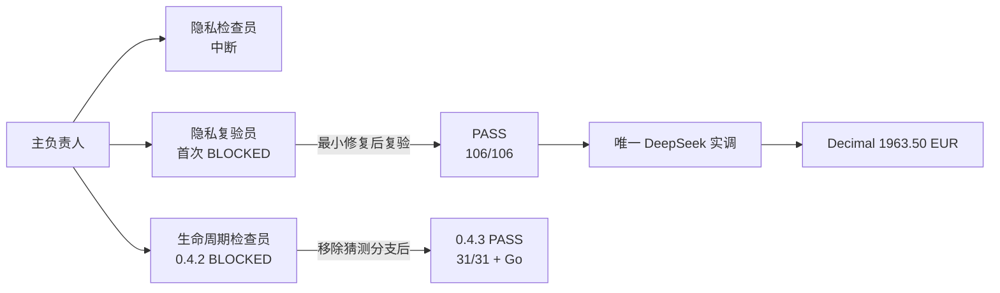

# Overnight 验收报告：工作流监控 0.4.3 与德国法律计费 Demo V2.3.3

日期：2026-08-26
结论：**两个一等目标均形成了可复核成果；法律 Demo 验收通过，用户完成 Hook 信任后，Codex→Kandev 自动事件桥也通过了全新真实子 Agent 生命周期验收。**

## 1. 执行边界

- 仅使用合成/匿名案例；没有读取、打印、落盘、提交或向监控/子 Agent 传递 `DEEPSEEK_API_KEY`。
- DeepSeek 只负责带逐字引文的概率性事实提取；金额只能由 Python `Decimal` 确定性引擎计算。
- Overnight 验收阶段没有生成或发送正式账单，没有联系外部人员，也没有 push、merge、deploy、发布或外发；本版本的 Git 提交与推送由用户在验收后另行明确授权。
- 正式 A/B 赛马历史保持冻结为 `NO_CONCLUSION / MISSING_USAGE`；本次赛后验收没有回写或重算历史。

## 2. 工作流监控成果

### 2.1 版本与改进

- Kandev 智能体监控插件升级到 `0.4.3`，安装位置：
  `/Users/wangxian/.kandev/plugins/ai-delivery-agent-observer/0.4.3`
- 安装包：
  `/Users/wangxian/Documents/ChatGPT/AI学习/codex-dev-orchestrator-ai-native/integrations/kandev-agent-observer/dist/ai-delivery-agent-observer-0.4.3-darwin-arm64.tar.gz`
- 安装包 SHA-256：`4ec278bd3bc96a623a17eb75c3f819e29796b4c63dd460e3cc7925487e2c8edd`
- receiver SHA-256：`4c105b3f0beed62b3dfe8ab418592b99d9b007a01c34b3e8caa806b74e0b7bb5`
- 二进制 SHA-256：`aa7b5f3ce8158e5e783ab6b00aeb8ed38cced155b0f4f7dfab016b57dbfcf74b`
- 删除了“只有一个未匹配 spawn 就猜 child”的最后一条推断分支。没有精确 child ID 时，页面只采用 `SubagentStart` 自带角色和根任务；只有 `PostToolUse` 精确证明 child ID 后，才回填中文职责和父节点。
- 状态口径继续分离：Kandev 原生、Codex 实时 Hook、Codex 持久化历史、Kandev 历史推断互不冒充。

### 2.2 生命周期与独立复验

- `privacy_audit`：原检查员中断，未被当作批准证据。
- `live_privacy_gate`：首次发现账务/恢复边界问题并给出 `BLOCKED`；最小修复后只读复验 `PASS`，106/106 测试通过。
- `lifecycle_audit`：0.4.2 因 child 身份仍可能猜测而 `BLOCKED`；0.4.3 移除分支后 `PASS`，Python 31/31 与适用 Go 测试通过。
- 独立检查者只读、拥有否决权，未由实现 owner 自批。

### 2.3 Hook 信任后的真实生命周期验收

- 用户随后在 `/hooks` 信任全部七类 Hook：`SessionStart`、`SessionEnd`、`SubagentStart`、`SubagentStop`、`PreToolUse`、`PostToolUse`、`PermissionRequest`；没有绕过信任边界。
- 全新真实根任务 `01a037b6-6fc1-76d0-b35e-69de2ec15162` 创建了无网络、无密钥、无产品写入的子 Agent `01a04119-6153-7530-ab80-fa98ae26c314`。
- Kandev 自动收到 `SessionStart → SubagentStart → 两次工程工具活动 → SubagentStop`。全部事件来源为 `codex_hooks`、质量为 `codex_hooks_realtime`，父节点和 child ID 精确一致；停止语义保持“已停止、结果未知”，没有冒充交付成功。
- 当前桥接健康文件为 `ready`，快照协议为 `codex-hooks-observer/v2`，最近成功事件无投递错误。页面中的历史与合成协议探针仍保持独立标签，不能冒充这条真实事件链。
- 端到端结论因此更新为：**伴生 Hook 已发现、已由人信任，并已把全新 Codex 子 Agent 的真实生命周期自动送入 Kandev。**
- 已知显示缺口仍保留：探针自定义名称降级为“实现智能体”；普通工具活动尚不能细分成独立的“等待/纠偏”语义。

当前页面截图：

## 3. 法律计费 Demo V2.3.3 成果

### 3.1 唯一真实 DeepSeek 调用

- 案例：`supported-complete-de`，仅合成邮件。
- 真实付费调用：1；恢复调用：0。
- usage：输入 1096、输出 1275、合计 2371 tokens。
- 延迟：9960 ms。
- 保守估算费用：`$0.00051044`；调用前按两次最坏情况预留 `$0.01881600`，低于 `$0.06` 硬预算。
- DeepSeek 输出通过逐字引文与 DTO 校验；响应正文、response ID 与密钥均未写入证据。
- Decimal 引擎计算：基础费 652.00；VV 3100 为 847.60；VV 3104 为 782.40；VV 7002 为 20.00；净额 1650.00；VAT 313.50；合计 **1963.50 EUR**。
- live 结论：`PASS`；`rule_status=UNVERIFIED_RULE`，`production_legal_result=false`，仍是单一冻结合成场景 Demo。

### 3.2 三类案例

| 案例 | 外部调用 | 结果 | 关键行为 |
|---|---:|---|---|
| 完整支持案例 | 1 | `CALCULATED / 1963.50 EUR` | DeepSeek 提取事实；Decimal 计算金额 |
| 缺 Gegenstandswert | 0 | `REVIEW_REQUIRED / MISSING_REQUIRED_FACTS` | 清除旧结果；追问 `Welcher Gegenstandswert soll angesetzt werden?` |
| 提示注入 | 0 | `REVIEW_REQUIRED / UNTRUSTED_INSTRUCTION` | 在 adapter 前拒绝；不产生金额 |

页面发布标识已更新为 V2.3.3。截图使用本地确定性离线浏览器适配器复核 UI、金额和审计链，**不是第二次 DeepSeek 调用**：

### 3.3 测试与证据

- 全量测试：106/106 PASS。
- 研究机械校验：3949。
- source-pack：26/26。
- 属性断言：928。
- mutation：10/10。
- 金额独立交叉核算：1963.50 EUR。
- 供应链：0 个第三方生产包；3/3 证据可复现。
- 两仓 `git diff --check` 均通过；两个新增 JSON 证据均可解析。

## 4. 证据绝对路径

### 法律 Demo

- 真实调用账本：
  `/Users/wangxian/Documents/ChatGPT/AI学习/german-legal-billing-v23-direct/evidence/overnight-acceptance-2026-08-26/deepseek-live-supported-complete-de.json`
- 零调用安全案例：
  `/Users/wangxian/Documents/ChatGPT/AI学习/german-legal-billing-v23-direct/evidence/overnight-acceptance-2026-08-26/zero-call-safety-cases.json`
- V2.3.3 版本说明：
  `/Users/wangxian/Documents/ChatGPT/AI学习/german-legal-billing-v23-direct/docs/v2.3.3-post-race-accounting.md`
- 法律页面截图：
  `/Users/wangxian/Documents/ChatGPT/AI学习/german-legal-billing-v23-direct/evidence/overnight-acceptance-2026-08-26/legal-demo-v2.3.3-offline-visual.png`

### 工作流监控

- 当前监控页截图：
  `/Users/wangxian/Documents/ChatGPT/AI学习/codex-dev-orchestrator-ai-native/evidence/overnight-acceptance-2026-08-26/kandev-monitor-0.4.3.png`
- 等待 Hook 信任截图：
  `/Users/wangxian/Documents/ChatGPT/AI学习/codex-dev-orchestrator-ai-native/evidence/overnight-acceptance-2026-08-26/kandev-observer-hook-awaiting-trust.png`
- 信任后真实生命周期截图：
  `/Users/wangxian/Documents/ChatGPT/AI学习/codex-dev-orchestrator-ai-native/evidence/overnight-acceptance-2026-08-26/kandev-observer-real-hook.png`
- 受控协议快照：
  `/Users/wangxian/Documents/ChatGPT/AI学习/codex-dev-orchestrator-ai-native/evidence/overnight-acceptance-2026-08-26/synthetic-protocol-probe/codex-hook-snapshot.json`
- 双通道健康：
  `/Users/wangxian/Documents/ChatGPT/AI学习/codex-dev-orchestrator-ai-native/evidence/overnight-acceptance-2026-08-26/synthetic-protocol-probe/codex-hook-bridge-health.json`

## 5. 已知限制与早晨待办

1. Hook 信任和全新真实生命周期探针已经完成；以后 Hook 定义发生变化时，新哈希仍必须重新人工审阅。
2. 自定义 Agent 中文名称目前可能降级为通用“实现智能体”，等待与纠偏也可能只显示为普通工程工具活动；这两个显示精度问题不影响生命周期真伪，但仍需后续协议支持。
3. 法律 Demo 仍只覆盖冻结的一个 2025 合成场景，不是法律或税务意见，不能用于真实客户、正式账单或生产自动计费。
4. 正式 A/B 赛马仍是 `NO_CONCLUSION / MISSING_USAGE`；V2.3.3 的单次赛后成功不得回写或重算该历史结论。
